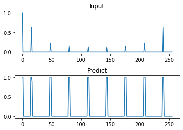

# PeakDetector

This is a Python library to  detect peaks in a vector.
The detector use a convolutional neural network in 1D.

## Using

Get the last version of PeakDetector using the next command

    git clone https://github.com/trucomanx/PeakDetector.git

Add the library to python system path.

    import sys
    sys.path.append('PeakDetector/src')

If we have an input vector called `vec_input` then, using the next code, the peaks in the input vector will be returned in the predicted vector `vec_predict`.

    import PeakDetector as pkpet
    
    Det=pkpet.PeakDetector1D();
    vec_predict=Det.FindPeaks(vec_input);

The input vector `vec_input` should be a numpy 1D array of 256 elements with values between 0 and 1.
The predicted vector `vec_predict` is a numpy 1D array of 256 elements with binary values, 0 or 1. 

The next image shows the input vector and the predicted vector.

## Example

A simple use example can be found in `tests/ploting_samples.py`
